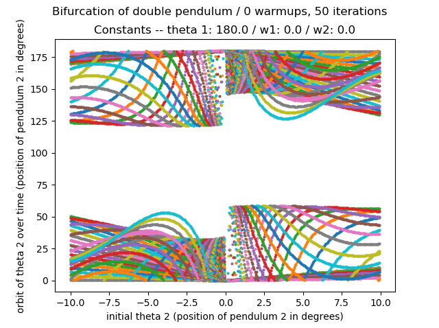
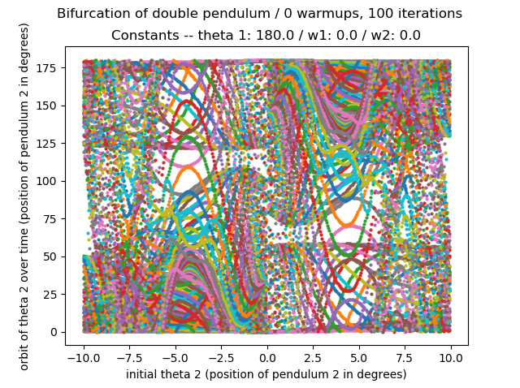
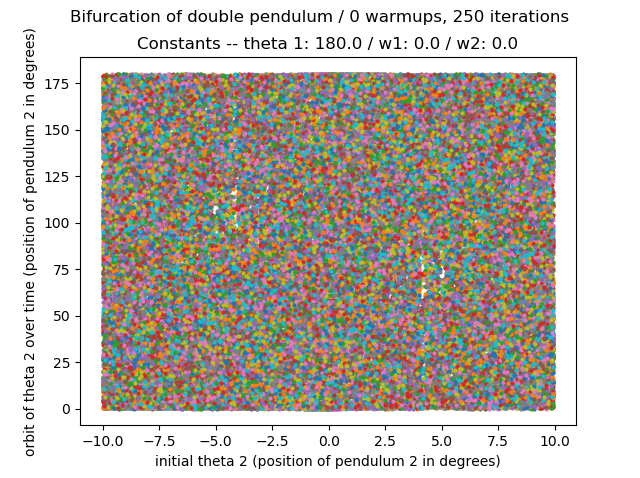
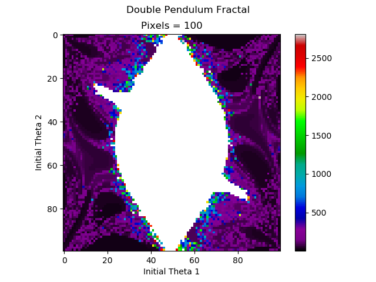

We have adapted the matplotlib code given at [https://matplotlib.org/examples/animation/double_pendulum_animated.html](https://matplotlib.org/examples/animation/double_pendulum_animated.html) to create and study a simulation of a double pendulum. 

### Double Pendulum Bifurcation
This is not really a "bifurcation" of the double pendulum, as nothing here seems to display such behavior. However, these images *do* show the double pendulum's path to chaos. With each frame we get a greater glimpse of the phase space of the second pendulum's movements--eventually everything dissolves into chaos.

#### Animation of Bifurcation

#### Double Pendulum Fractal

We recreate the graph of time it takes for the double pendulum to flip over. This image is a recreation, originally done by Jeremy S. Heyl 
White represents that the double pendulum does not flip within 10000 √(l⁄g)

