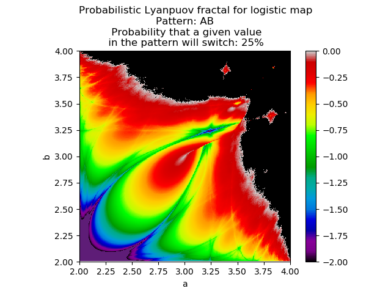
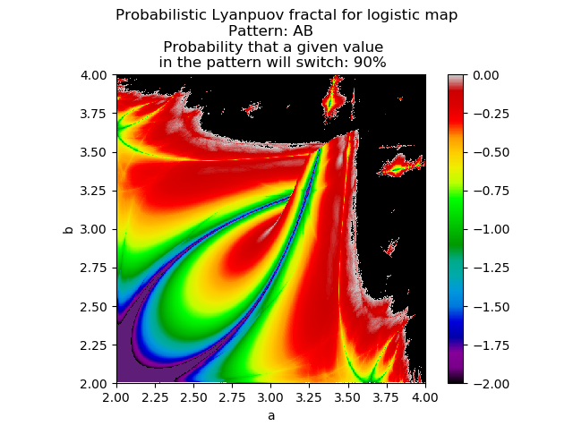
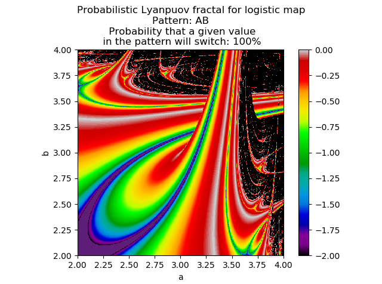
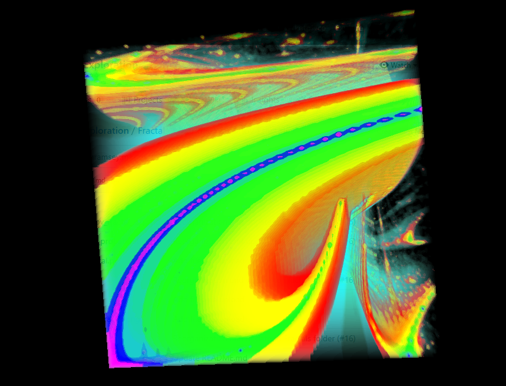
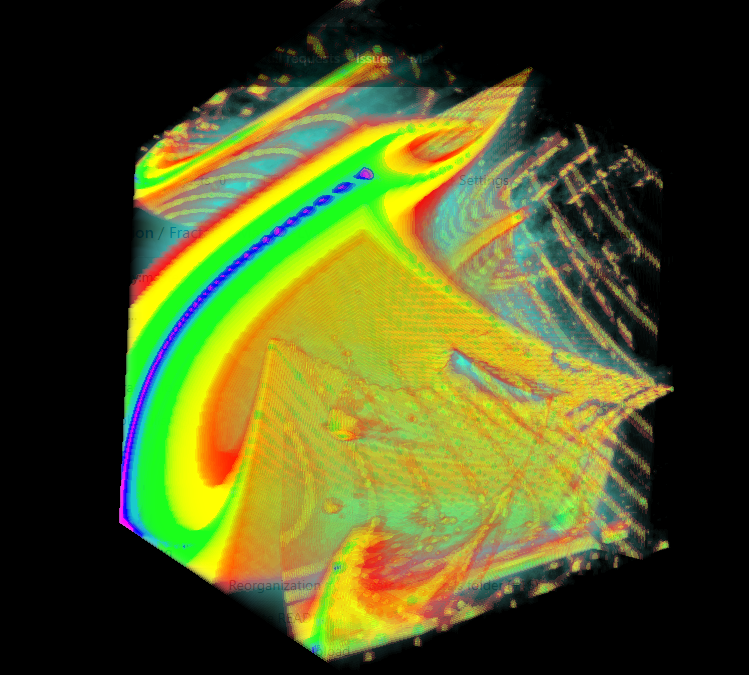
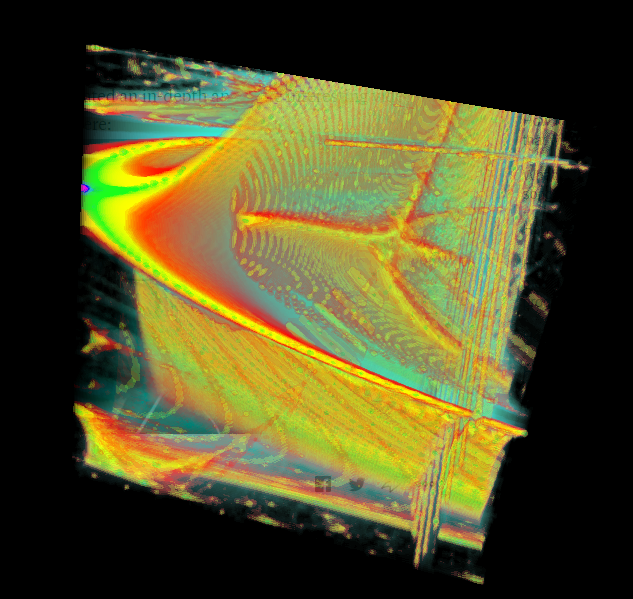
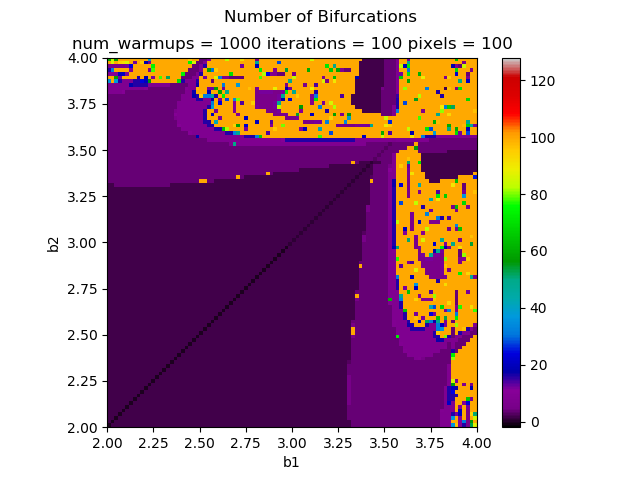
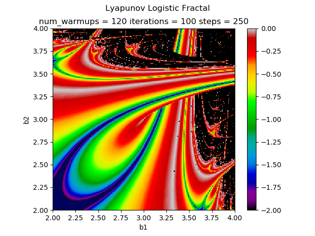
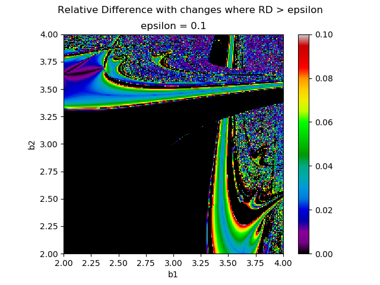

We have recreated the original Markus-Lyapunov fractal ([https://en.wikipedia.org/wiki/Lyapunov_fractal](https://en.wikipedia.org/wiki/Lyapunov_fractal)) in python with matplotlib to explore its properties.

## Stochasticity and Probability

### Stochastic AB Lyapunov fractal — in sequence "AB" there is a 50% chance at any time that the value will switch to the other (i.e., that A will switch to B and vice versa)

### Probabilistic AB Lyapunov fractal -- in "AB" the probability that the value will switch varies is listed above the graph

### Animation (created using ImageMagick and ArtistAnimation) of the fractal changing with the probability

## 2D Traversal of 3D Lyapunov space -- each frame is the a-b fractal generated for that fixed value of c

## 3D projection of Lyapunov space -- x-axis = a, y-axis = b, z-axis = c
If you look at the first image, you will see the first frame of the above animation represented in the front face of the cube. The white pixels--representing the border of chaos--have been replaced by translucent blue voxels for easier view of the inside structure. Chaotic voxels are completely transparent.

### Front face

### Turned 90 degrees

### Back face

## Using Fprime to Determine the Bifurcation Pattern of the Lyapunov Fractal

## Finding the Relative Difference between Lyapunov Exponents in a Single Fractal

