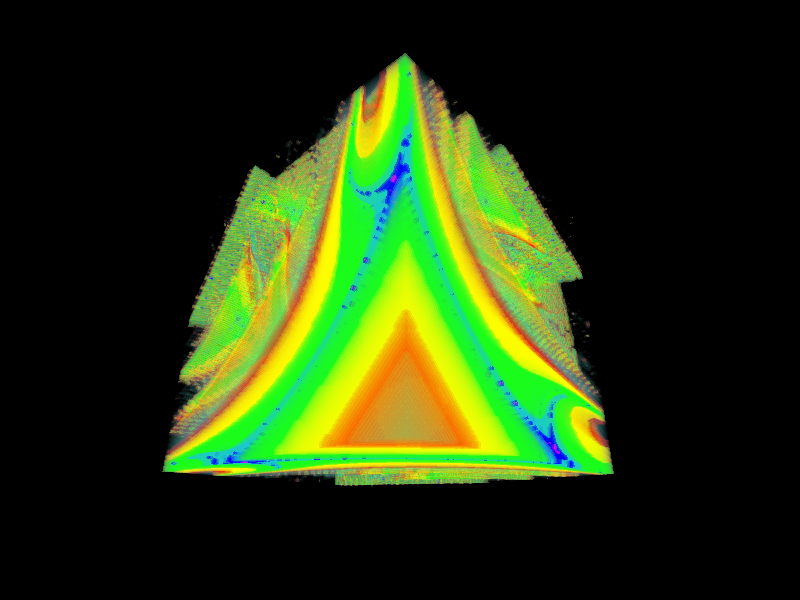
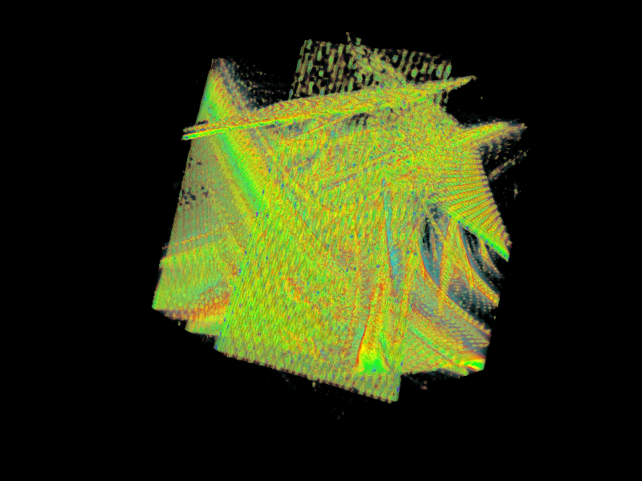
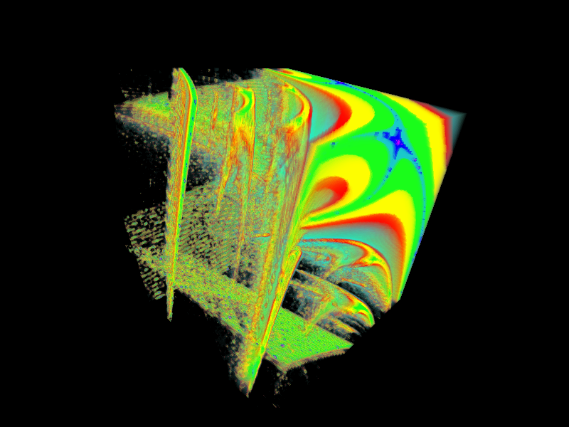

The SuPeR fractal, based on the Lyapunov-Markov fractal, was created by Shaun Ramsey, Dylan Poulsen, and Nathaniel Schwartz in 2017. The original repository can be found here: [https://github.com/shaunramsey/SuPeRFractal](https://github.com/shaunramsey/SuPeRFractal).

We have recreated this fractal in matplotlib and [VisPy](http://vispy.org/index.html) in order to explore it further. 

### Various SuPeR fractals

### Probabilistic SuPeR fractal — for sequence b1 repeated N number of times, b2 repeated N number of times — the probability of the values switching is displayed at the top of the image
NOTE: Each frame of the animation has been averaged. In other words, multiple pictures, each with a different random sequence based on the probability, were computed and then averaged together in an attempt to improve the "shakiness" and randomness of the animation.

### 2D Traversal of 3D SuPer fractal space — for sequence b1, b2, b3 — each frame of the animation is the b1-b2 fractal generated for that fixed value of b3 
This animation gives a glimpse into 3D space by taking 2D slices of the 3D fractal at certain values. 

### 3D SuPeR Fractal — a = 0.1, n = 1
### b1 = x-axis, b2 = y-axis, b3 = z-axis
Using Vispy, we have create a 3D projection of the SuPeR Fractal. The extended version of the code w/ controls (titled [3D_SuPeR_Controls.py](3D_SuPeR_Controls.py)) can export a .gif of the fractal rotating and save still images of the canvas.

